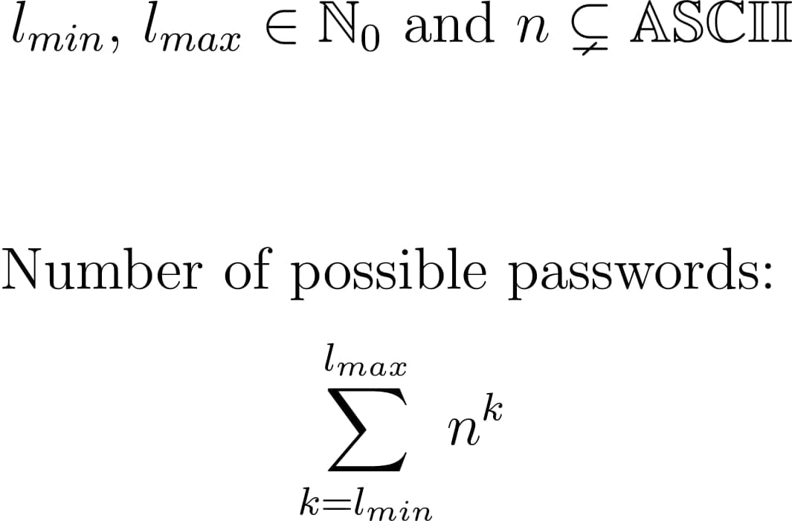

# password
password creator and brute forcer

- Let `l_min` and `l_max` be the minimum and maximum password lengths.
- In the following, `n` will be the set of all characters used to compose the password. (In the following,
`n` is defined as a real subset of the ASCII set, since ASCII can be used internationally without any problems.
Elements of the UTF-8 code may not be supported on some websites.)

  

